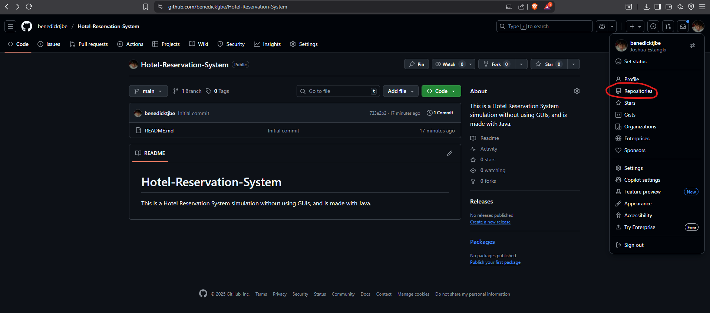
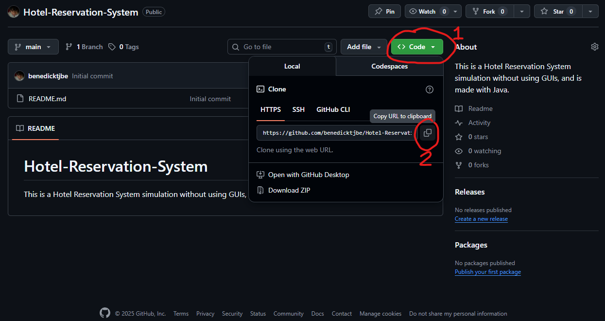
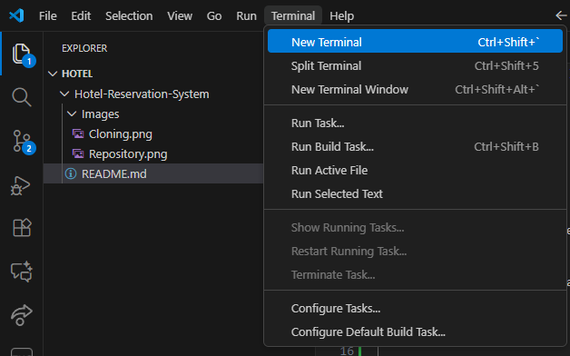

# Hotel-Reservation-System
This is a Hotel Reservation System simulation without using GUIs, and is made with Java.

# Standards
1. Spacing
    Space each line of code correctly and by category. By 'category', there should be an empty space after each logical grouping (validation, output, input, etc.)

2. Variable Names
    Variable names should be specific.

3. Committing and Pushing
    Add a clear commit message, and INFORM THE GROUP FIRST before pushing.

# Navigating through GitHub
1. Cloning a repository

    If you do not have git installed yet, install it first via the install link:
    [Git install link](https://git-scm.com/install/)

    Go to your repositories located at the left side of the GitHub Website, and click on the "Hotel-Reservation-System" repository.
    

    Click on "Code" then copy the HTTPS url
    

    Go to GitHub and open an empty folder where you want the repository to be cloned. After, click on terminal then select "new terminal"
    

    In the terminal, write the command "git clone" then paste the url of the repository you have copied.
    

    You have now successfully cloned a repository!
